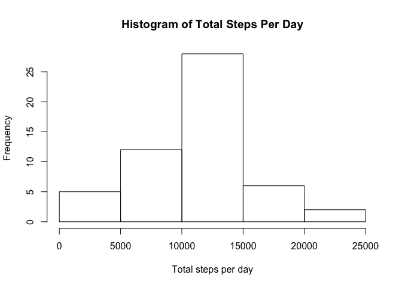
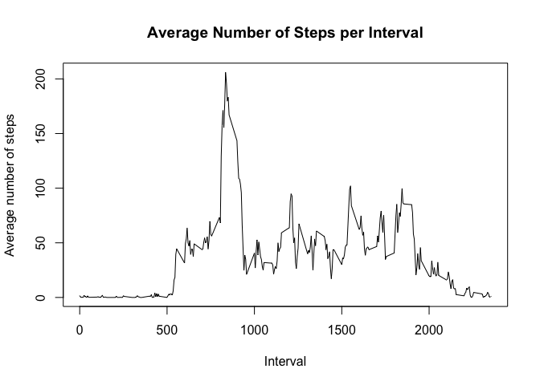
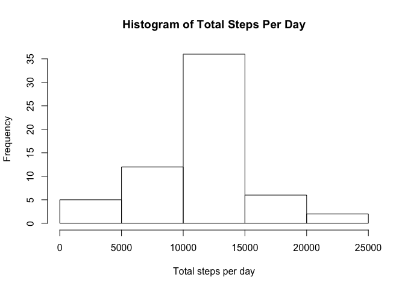
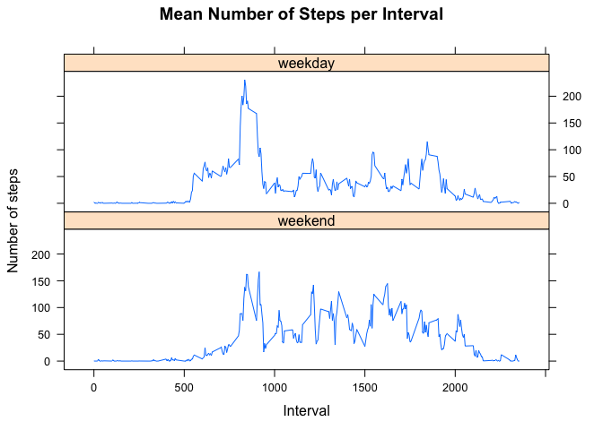

# Reproducible Research: Peer Assessment 1


## Loading and preprocessing the data

With the data stored as `activity.csv` in the working directory, it is loaded into R.


```r
#(1) Loading the data
actData <- read.csv("activity.csv", colClasses = c("numeric", "Date", "integer"))
```

## What is mean total number of steps taken per day?

The total steps per day for each date are calculated, and plotted into a histogram to show the frequency of the totals. The mean and median total steps per day values are calculated.


```r
#(1) Calculating the total number of steps taken per day. Aggregate, by default, ignores NA values.
totStepDay <- aggregate(steps ~ date, data = actData, sum, na.rm = TRUE)

#(2) Generating histogram of total steps per day
hist(totStepDay$steps,
     main = "Histogram of Total Steps Per Day",
     xlab = "Total steps per day")
```



```r
#(3) Mean number of steps per day
mean(totStepDay$steps)
```

```
## [1] 10766.19
```

```r
#(3) Median number of steps per day
median(totStepDay$steps)
```

```
## [1] 10765
```

## What is the average daily activity pattern?

The average number of steps taken for each 5-minute interval across all days is calculated. It is then plotted against the 5-minute interval to generate a time series plot. The interval at which the average number of steps was at a maximum is then calculated.


```r
#Calculating average number of steps taken during each interval across all days
meanStepInt <- aggregate(steps ~ interval, data = actData, mean, na.rm = TRUE)

#(1) Generating time series plot of interval vs average number of steps per interval across all days
with(meanStepInt, plot(interval, steps, type = "l", 
                       main = "Average Number of Steps per Interval",
                       xlab = "Interval",
                       ylab = "Average number of steps"))
```



```r
#(2) Interval with the maximum number of steps, on average
meanStepInt[which.max(meanStepInt$steps),1]
```

```
## [1] 835
```


## Imputing missing values

The number of rows with missing values is calculated. A copy of the dataset is made, but with the missing values replaced by the average number of steps for the respective 5-minute interval. A histogram of the new total number of steps per day is then generated, along with the new mean and median.


```r
#(1) Number of rows with missing data
sum(!complete.cases(actData))
```

```
## [1] 2304
```

```r
#Generating copy of activity data
actDataComp <- actData

#(2)(3) Replacing missing values with the mean value of its interval
for(i in 1:nrow(actDataComp)){
        if(is.na(actDataComp[i,1])){
                actDataComp[i,1] <- meanStepInt[meanStepInt$interval == actDataComp[i,3], 2]
        }
}

#Calculating the total number of steps taken per day using the filled in data
totStepDayComp <- aggregate(steps ~ date, data = actDataComp, sum)

#(4) Generating histogram of total steps per day
hist(totStepDayComp$steps,
     main = "Histogram of Total Steps Per Day",
     xlab = "Total steps per day")
```



```r
#(4) Mean number of steps per day
mean(totStepDayComp$steps)
```

```
## [1] 10766.19
```

```r
#(4) Mean number of steps per day
median(totStepDayComp$steps)
```

```
## [1] 10766.19
```

As shown, replacing missing data with the method specified above has only had a small effect on the median, but has not affected the mean.

## Are there differences in activity patterns between weekdays and weekends?

To identify if there are differences in activity patterns between weekdays and weekends, a new factor variable specifiying whether a particular day is a weekend or a weekday is added to the dataset. Time series plots of the 5-minute interval and average number of steps across weekdays and weekends are then generated.


```r
#(1) Generating a new factor variable
actDataComp$day <- factor((weekdays(actDataComp$date) %in% c("Saturday", "Sunday")), 
                              levels=c(TRUE, FALSE), 
                              labels=c("weekend", "weekday"))

#Calculating average number of steps per day per interval
meanStepIntWkday <- with(actDataComp, aggregate(list(steps = steps), 
                              list(day = day, interval = interval),
                              mean))

#(2) Generating panel plot containing time series plots of interval vs the average number of steps per interval across weekdays and weekends
library(lattice)

xyplot(steps ~ interval | day, meanStepIntWkday, type = "l", layout = c(1,2),
       main = "Mean Number of Steps per Interval",
       xlab = "Interval", 
       ylab = "Number of steps")
```


